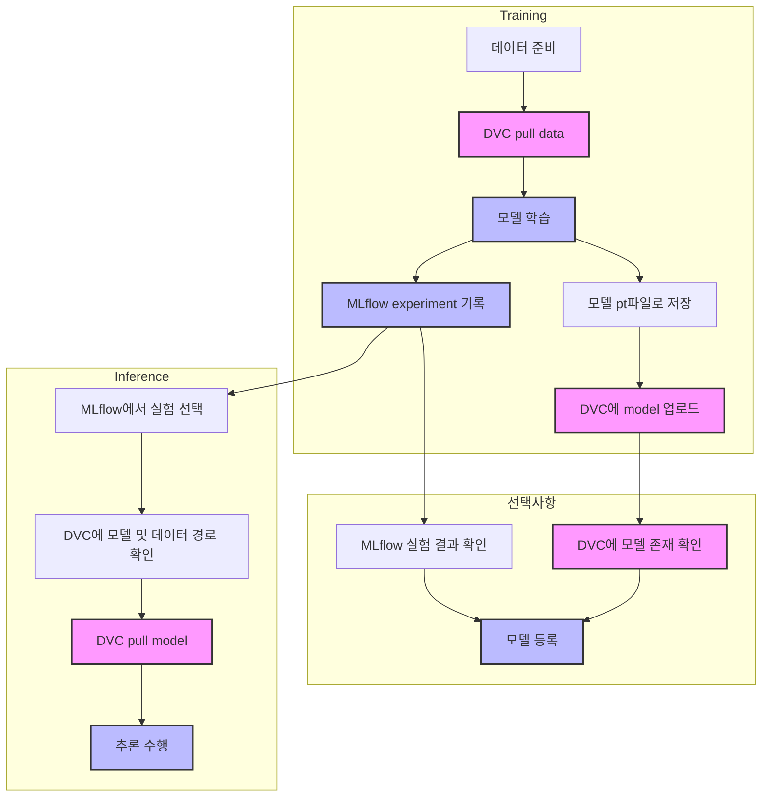

# DVC Project (Wine Quality Prediction with MLOps)

이 프로젝트는 MLflow와 DVC를 결합하여 효율적인 ML 실험 및 데이터/모델 관리를 구현한 예제입니다:
- MLflow: 실험 메타데이터(파라미터, 메트릭, 아티팩트 경로) 추적
- DVC: 실제 데이터 파일과 모델 파일의 버전 관리

## 시스템 구성

- **Git**: 소스 코드 버전 관리
- **DVC**: 데이터와 모델 파일 버전 관리
- **MLflow**: 실험 메타데이터 추적 및 모델 레지스트리

## 워크플로우 다이어그램


## 프로젝트 구조
```
dvc-test/
├── .dvc/               # DVC 설정 디렉토리
├── train/              # 학습 관련 모듈
├── inference/          # 추론 관련 모듈
├── setting.py          # AWS S3 설정
├── config.py           # 프로젝트 설정
├── train.py           # 학습 실행 스크립트
├── register_model.py  # 모델 등록 스크립트 (선택사항)
└── infer.py           # 추론 실행 스크립트
```

## 디팬던시 설치

```bash
pip install -r requirements.txt
```

## 데이터 버전 관리

### 데이터 변경 시 작업 순서

```bash
# 1. 데이터 변경 후 DVC 추적
dvc add <변경된_데이터_경로>

# 2. 변경된 데이터 원격 저장소에 업로드
dvc push

# 3. Git에 변경사항 기록
git add <데이터_경로>.dvc
git commit -m "Update data: <변경 내용 설명>"
git push
```

### 실험 관리

```bash
# 1. 실험용 브랜치 생성
git checkout -b experiment/<실험명>

# 2. 실험 수행 및 데이터 변경

# 3. 변경된 데이터 추적
dvc add <변경된_데이터_경로>
dvc push

# 4. Git에 실험 결과 기록
git add <데이터_경로>.dvc
git commit -m "Experiment: <실험 결과 설명>"
git push origin experiment/<실험명>
```

### 다른 환경에서 데이터 가져오기

```bash
# 1. Git 저장소 복제
git clone <저장소_주소>

# 2. 데이터 다운로드
dvc pull
```

## 시스템 아키텍처

### 1. 데이터 및 모델 관리
- **DVC**: 실제 데이터와 모델 파일을 저장하고 버전 관리
  - 학습 데이터: `data/wine-quality.csv`
  - 모델 파일: `models/model.pt`

- **MLflow**: 실험 메타데이터 추적
  - 하이퍼파라미터
  - 학습 메트릭 (MAE, RMSE 등)
  - DVC 모델/데이터 경로
  - Git commit hash

### 2. 워크플로우

1. **모델 학습 (train.py)**
   - DVC로 데이터 가져오기
   - 모델 학습 수행
   - MLflow에 메타데이터 기록:
     - 하이퍼파라미터
     - 학습 메트릭
     - DVC 모델/데이터 경로
   - 모델 파일을 DVC에 저장

2. **모델 등록 (register_model.py) [선택사항]**
   - MLflow에서 실험 결과 확인
   - 성능이 기준을 만족하면 모델 메타데이터 등록
   - 실제 모델은 DVC에 유지
   - infer.py에서 MLflow의 메타데이터를 통해 DVC에서 직접 모델을 가져올 수 있으므로 이 단계는 선택사항입니다.

3. **모델 추론 (infer.py)**
   - MLflow에서 실험 선택 (메타데이터)
   - MLflow에서 DVC 모델/데이터 경로 확인
   - DVC에서 실제 모델 다운로드
   - 추론 수행

## Git과 DVC 설정 가이드


### 주의사항

1. setting.py 사용 시 (AWS S3):
   - AWS 자격 증명이 필요함
   - S3 버킷이 미리 생성되어 있어야 함
   - AWS 자격 증명 파일은 절대 Git에 커밋하지 않음
   - .dvcignore에 aws/ 디렉토리 추가 필요

2. 로컬 DVC 사용 시:
   - 로컬 저장소 경로가 유효해야 함
   - 팀원 간 동일한 저장소 구조 유지 필요

### 공통 작업

```bash
# 실험 관리
git checkout -b experiment
# 실험 후
dvc add <변경된_파일_경로>
git add <파일명>.dvc
git commit -m "Update with experiment results"

# 변경사항 공유
dvc push  # 데이터/모델 공유
git push  # 메타데이터 공유
```

## 사용 방법


### 1. 모델 학습
```bash
python train.py
```
- DVC에서 데이터를 가져옵니다
- 모델이 학습되고 DVC에 저장됩니다
- MLflow에 실험 메타데이터가 기록됩니다

### 2. 모델 등록 (선택사항)
```bash
python register_model.py
```
- MLflow에 모델 메타데이터를 등록합니다
- `--manual` 옵션으로 수동 등록 가능
- infer.py에서 MLflow의 메타데이터를 통해 DVC에서 직접 모델을 가져올 수 있으므로 이 단계는 선택사항입니다.

### 3. 모델 추론
```bash
python infer.py
```
- MLflow에서 등록된 모델 메타데이터를 선택합니다
- DVC에서 실제 모델을 다운로드합니다
- `--interactive` 옵션으로 수동 모델 선택 가능

## 데이터셋 정보

UCI Wine Quality 데이터셋을 사용합니다:
- 출처: https://archive.ics.uci.edu/ml/datasets/wine+quality
- 구분자: 세미콜론 (;)
- 특성: fixed acidity, volatile acidity, citric acid 등
- 타겟: quality (0~10 사이의 점수)

## 주의사항

- Git은 소스 코드 관리, DVC는 데이터/모델 관리, MLflow는 메타데이터 추적용으로 사용됩니다
- DVC remote와 MLflow 서버가 올바르게 설정되어 있어야 합니다
- 환경 변수가 올바르게 설정되어 있어야 합니다
