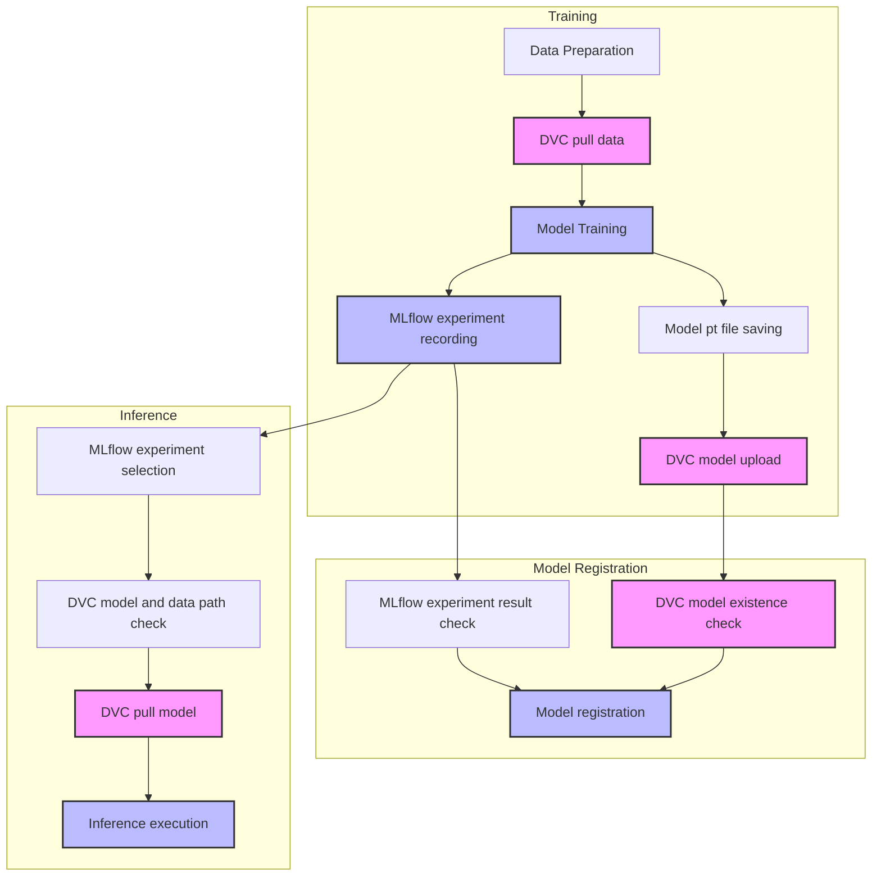

# DVC Project (Wine Quality Prediction with MLOps)

This project is an example of implementing efficient ML experimentation and data/model management by combining MLflow and DVC:
- MLflow: Track experiment metadata (parameters, metrics, artifact paths)
- DVC: Version control of actual data files and model files

## System Configuration

- **Git**: Source code version control
- **DVC**: Data and model file version control
- **MLflow**: Experiment metadata tracking and model registry

## Workflow Diagram



## Project Structure
```
dvc-test/
├── .dvc/               # DVC configuration directory
├── train/              # Training-related modules
├── inference/          # Inference-related modules
├── setting.py          # AWS S3 settings
├── config.py           # Project settings
├── train.py           # Training execution script
├── register_model.py  # Model registration script (optional)
└── infer.py           # Inference execution script
```

## Dependency Installation

```bash
pip install -r requirements.txt
```

## Data Version Management

### Data Change Workflow

```bash
# 1. Track data changes with DVC
dvc add <changed_data_path>

# 2. Upload changed data to remote storage
dvc push

# 3. Record changes in Git
git add <data_path>.dvc
git commit -m "Update data: <change_description>"
git push
```

### Experiment Management

```bash
# 1. Create an experiment branch
git checkout -b experiment/<experiment_name>

# 2. Perform the experiment and change data

# 3. Track changed data
dvc add <changed_data_path>
dvc push

# 4. Record experiment results in Git
git add <data_path>.dvc
git commit -m "Experiment: <experiment_result_description>"
git push origin experiment/<experiment_name>
```

### Retrieving Data in Another Environment

```bash
# 1. Clone the Git repository
git clone <repository_address>

# 2. Download data
dvc pull
```

## System Architecture

### 1. Data and Model Management
- **DVC**: Store and version control actual data and model files
  - Training data: `data/wine-quality.csv`
  - Model file: `models/model.pt`

- **MLflow**: Track experiment metadata
  - Hyperparameters
  - Training metrics (MAE, RMSE, etc.)
  - DVC model/data paths
  - Git commit hash

### 2. Workflow

1. **Model Training (train.py)**
   - Use DVC to retrieve data
   - Perform model training
   - Record metadata in MLflow:
     - Hyperparameters
     - Training metrics
     - DVC model/data paths
   - Save the model file to DVC

2. **Model Registration (register_model.py) [Optional]**
   - Check experiment results in MLflow
   - Register model metadata if performance meets the criteria
   - The actual model is stored in DVC
   - infer.py can directly retrieve the model from DVC using MLflow's metadata, so this step is optional.

3. **Model Inference (infer.py)**
   - Select an experiment in MLflow (metadata)
   - Check DVC model/data paths in MLflow
   - Download the actual model from DVC
   - Perform inference

## Git and DVC Setup Guide

### Precautions

1. When using setting.py (AWS S3):
   - AWS credentials are required
   - An S3 bucket must be created in advance
   - AWS credential files should never be committed to Git
   - Add the aws/ directory to .dvcignore

2. When using local DVC:
   - The local repository path must be valid
   - Team members must maintain the same repository structure

### Common Tasks

```bash
# Experiment management
git checkout -b experiment
# After the experiment
dvc add <changed_file_path>
git add <file_name>.dvc
git commit -m "Update with experiment results"

# Share changes
dvc push  # Share data/models
git push  # Share metadata
```

## Usage

### 1. Run the MLflow Server:
```bash
mlflow server --host localhost --port 5000
```

### 2. Model Training
```bash
python train.py
```
- Retrieves data from DVC
- Trains the model and saves it to DVC
- Records experiment metadata in MLflow

### 3. Model Registration (Optional)
```bash
python register_model.py
```
- Registers model metadata in MLflow
- Can be registered manually with the `--manual` option
- infer.py can directly retrieve the model from DVC using MLflow's metadata, so this step is optional.

### 4. Model Inference
```bash
python infer.py
```
- Selects a registered model in MLflow
- Downloads the actual model from DVC
- Can select a model interactively with the `--interactive` option

## Dataset Information

Uses the UCI Wine Quality dataset:
- Source: https://archive.ics.uci.edu/ml/datasets/wine+quality
- Separator: Semicolon (;)
- Features: fixed acidity, volatile acidity, citric acid, etc.
- Target: quality (score between 0 and 10)

## Precautions

- Git is used for source code management, DVC for data/model management, and MLflow for metadata tracking
- DVC remote and MLflow server must be properly configured
- Environment variables must be properly set
