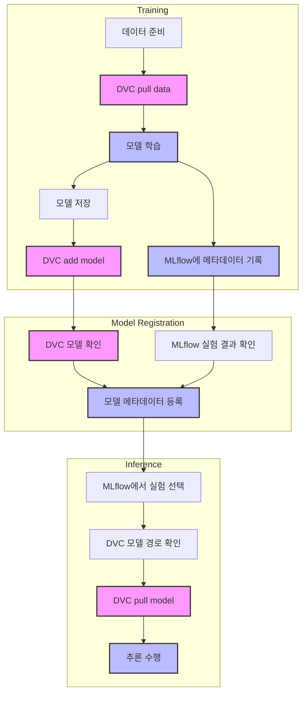

# 와인 품질 예측 프로젝트

이 프로젝트는 MLflow와 DVC를 결합하여 효율적인 ML 실험 및 데이터/모델 관리를 구현한 예제입니다:
- MLflow: 실험 메타데이터(파라미터, 메트릭, 아티팩트 경로) 추적
- DVC: 실제 데이터 파일과 모델 파일의 버전 관리

## 시스템 구성

- **Git**: 소스 코드 버전 관리
- **DVC**: 데이터와 모델 파일 버전 관리
- **MLflow**: 실험 메타데이터 추적 및 모델 레지스트리

## 워크플로우 다이어그램



## 설치 방법

1. 필요한 패키지 설치:
```bash
pip install -r requirements.txt
```

2. DVC 설정:
```bash
dvc init
dvc remote add -d myremote s3://mybucket/dvcstore
```

3. MLflow 설정:
- MLflow 서버 실행:
```bash
mlflow server --backend-store-uri sqlite:///mlflow.db --default-artifact-root ./mlruns
```
- `config.py`에서 MLflow 접속 정보 설정

## 시스템 아키텍처

### 1. 데이터 및 모델 관리
- **DVC**: 실제 데이터와 모델 파일을 저장하고 버전 관리
  - 학습 데이터: `data/wine-quality.csv`
  - 모델 파일: `models/model.pt`

- **MLflow**: 실험 메타데이터 추적
  - 하이퍼파라미터
  - 학습 메트릭 (MAE, RMSE 등)
  - DVC 모델 경로
  - Git commit hash

### 2. 워크플로우

1. **모델 학습 (train.py)**
   - DVC로 데이터 가져오기
   - 모델 학습 수행
   - MLflow에 메타데이터 기록:
     - 하이퍼파라미터
     - 학습 메트릭
     - DVC 모델 경로
   - 모델 파일을 DVC에 저장

2. **모델 등록 (register_model.py)**
   - DVC에서 모델 존재 확인
   - MLflow에서 실험 결과 확인
   - 성능이 기준을 만족하면 모델 메타데이터 등록
   - 실제 모델은 DVC에 유지

3. **모델 추론 (infer.py)**
   - MLflow에서 실험 선택 (메타데이터)
   - MLflow에서 DVC 모델 경로 확인
   - DVC에서 실제 모델 다운로드
   - 추론 수행

## 사용 방법

### 1. 모델 학습
```bash
python train.py
```
- DVC에서 데이터를 가져옵니다
- 모델이 학습되고 DVC에 저장됩니다
- MLflow에 실험 메타데이터가 기록됩니다

### 2. 모델 등록
```bash
python register_model.py
```
- DVC에 저장된 모델을 확인합니다
- MLflow에 모델 메타데이터를 등록합니다
- `--manual` 옵션으로 수동 등록 가능

### 3. 모델 추론
```bash
python infer.py
```
- MLflow에서 등록된 모델 메타데이터를 선택합니다
- DVC에서 실제 모델을 다운로드합니다
- `--interactive` 옵션으로 수동 모델 선택 가능

## 프로젝트 구조
```
dvc-test/
├── train/              # 학습 관련 모듈
│   ├── base_train.py   # 기본 학습 로직
│   ├── dvc_train.py    # DVC 관련 기능
│   └── mlflow_train.py # MLflow 관련 기능
├── inference/          # 추론 관련 모듈
│   ├── base_inference.py # 기본 추론 로직
│   ├── dvc_inference.py  # DVC 관련 기능
│   └── mlflow_inference.py # MLflow 관련 기능
├── data/              # 데이터 디렉토리
├── models/            # 모델 디렉토리
├── train.py           # 학습 스크립트
├── register_model.py  # 모델 등록 스크립트
└── infer.py           # 추론 스크립트
```

## 데이터셋 정보

UCI Wine Quality 데이터셋을 사용합니다:
- 출처: https://archive.ics.uci.edu/ml/datasets/wine+quality
- 구분자: 세미콜론 (;)
- 특성: fixed acidity, volatile acidity, citric acid 등
- 타겟: quality (0~10 사이의 점수)

## 주의사항

- Git은 소스 코드 관리, DVC는 데이터/모델 관리, MLflow는 메타데이터 추적용으로 사용됩니다
- DVC remote와 MLflow 서버가 올바르게 설정되어 있어야 합니다
- 환경 변수가 올바르게 설정되어 있어야 합니다
