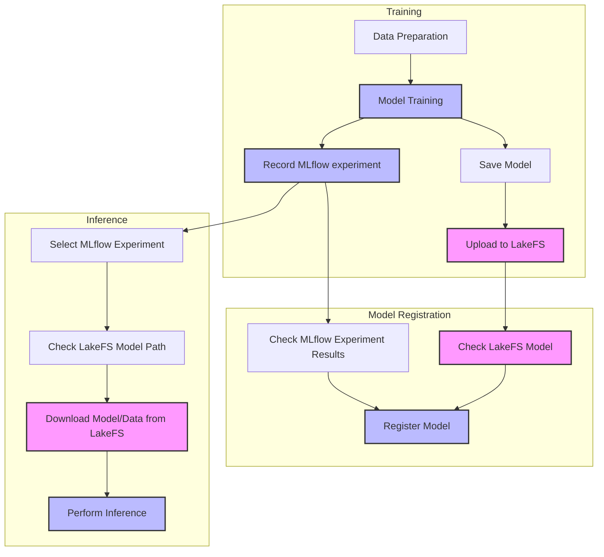

# LakeFS Project (Image Segmentation with MLOps)

MLOps pipeline for training, version control, and inference of image segmentation models.

## System Components

- **Git**: Source code version control
- **LakeFS**: Data and model file version control
- **MLflow**: Experiment metadata tracking and model registry

## Workflow Diagram



## Key Components

### Git
- Code version control
- Version tagging for important releases

### LakeFS
- Data and model file version control
- Store Git information as metadata
- Use MinIO as backend storage

### MLflow
- Experiment tracking
- Hyperparameter management
- Metric visualization

## Installation
1. Install required packages:
```bash
pip install -r requirements.txt
```

2. Configuration:
```
Set server information in config.py
```
3. Run LakeFS and MinIO:
```bash
docker compose --profile local-lakefs up
```

4. Run MLflow server:
```bash
mlflow server --host localhost --port 5000
```

## Features

### 1. Data and Model Management
- **LakeFS**: Store and version control actual data and model files
  - Training data: `lakefs://image-segmentation-local-repo/main/data/`
  - Model file: `lakefs://image-segmentation-local-repo/main/models/model.pth`

- **MLflow**: Track experiment metadata
  - Hyperparameters
  - Training metrics (loss, accuracy, etc.)
  - LakeFS model path
  - Git commit hash

### 2. Workflow

1. **Model Training (train.py)**
   - Prepare data
   - Perform model training
   - Record metadata in MLflow:
     - Hyperparameters
     - Training metrics
     - LakeFS model/data paths
     - LakeFS commit hash
     - Git commit hash
   - Save model file to LakeFS

2. **Model Registration (register_model.py) [Optional]**
   - Check experiment results in MLflow
   - Register model metadata if performance meets criteria
   - Keep actual model in LakeFS
   - Optional as infer.py can get the model directly from LakeFS using MLflow metadata

3. **Model Inference (infer.py)**
   - Select experiment from MLflow (metadata)
   - Check LakeFS model/data path from MLflow
   - Download actual model and data from LakeFS
   - Perform inference

## Usage

### 1. Model Training
```bash
python train.py
```
- Model is trained and `models/model.pth` file is created
- Experiment metadata is recorded in MLflow
- Trained model is uploaded to LakeFS

### 2. Model Registration (Optional)
```bash
python register_model.py
```
- Register model metadata in MLflow
- Use `--manual` option for manual registration
- Optional as infer.py can get the model directly from LakeFS using MLflow metadata

### 3. Model Inference
```bash
python infer.py
```
- Select registered model metadata from MLflow
- Download actual model and data from LakeFS
- Use `--interactive` option for manual model selection

## Notes

- LakeFS and MLflow servers must be running
- Environment variables must be properly configured
- Git is used for source code management, LakeFS for data/model management, and MLflow for metadata tracking
