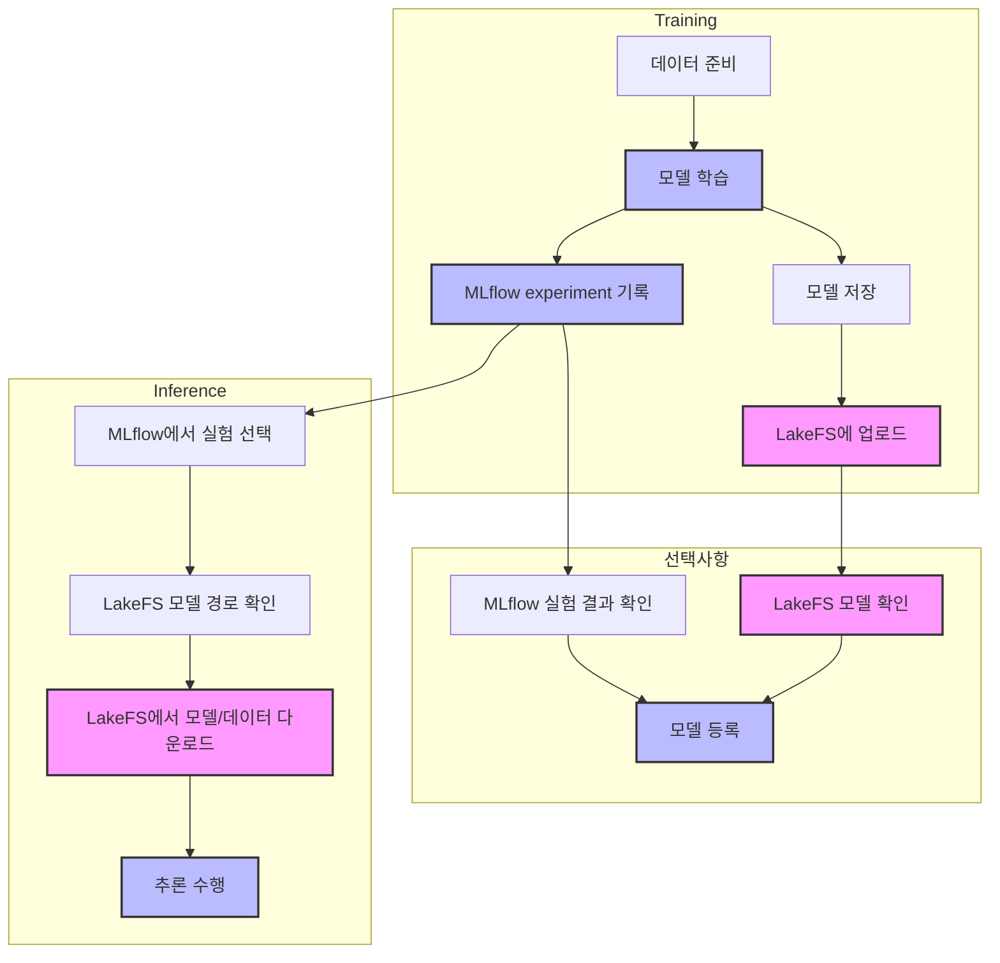
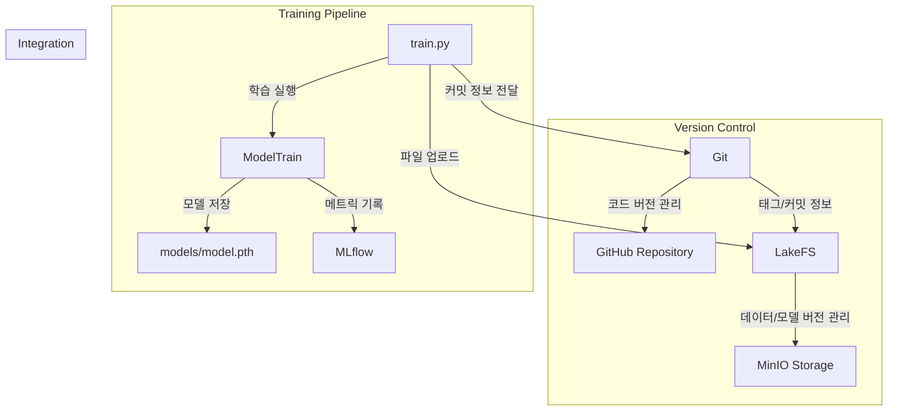
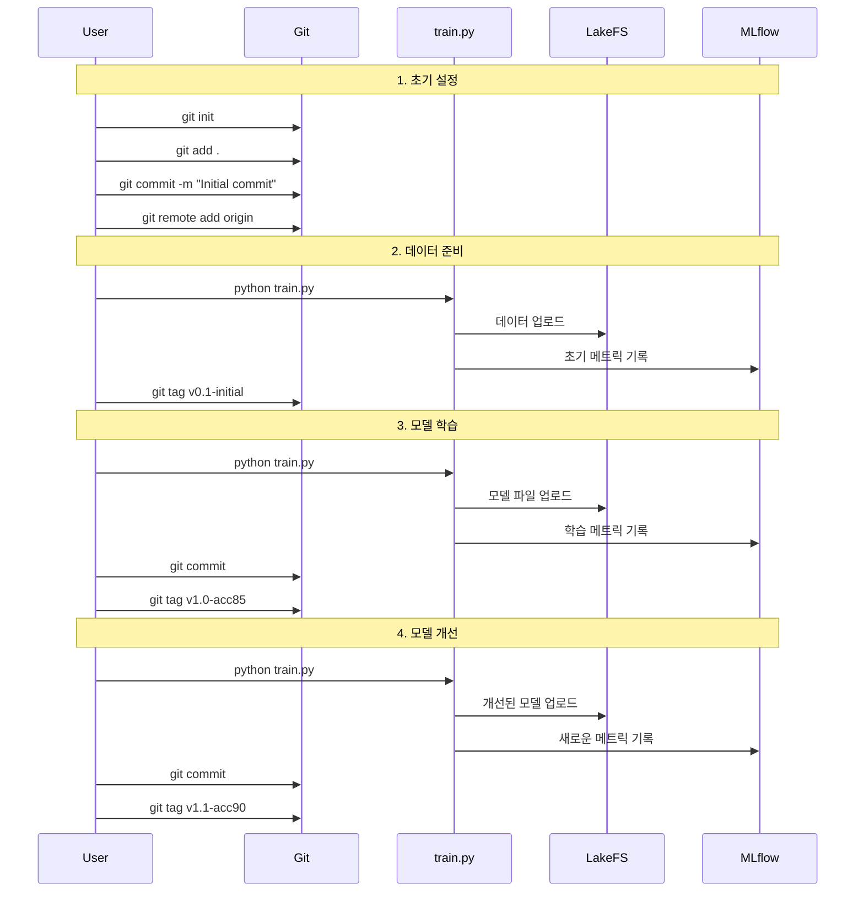

# LakeFS 프로젝트(Image Segmentation with MLOps)

이미지 세그멘테이션 모델의 학습, 버전 관리, 추론을 위한 MLOps 파이프라인입니다.


## 시스템 구성

- **Git**: 소스 코드 버전 관리
- **LakeFS**: 데이터와 모델 파일 버전 관리
- **MLflow**: 실험 메타데이터 추적 및 모델 레지스트리

## 워크플로우 다이어그램



## 시스템 아키텍처



## 작업 흐름 다이어그램



## 주요 컴포넌트

### Git
- 코드 버전 관리
- 태그를 통한 중요 버전 표시
- 커밋 메시지에 LakeFS 정보 포함

### LakeFS
- 데이터 및 모델 파일 버전 관리
- Git 정보를 메타데이터로 저장
- MinIO를 백엔드 스토리지로 사용

### MLflow
- 실험 추적
- 하이퍼파라미터 관리
- 메트릭 시각화

## 디렉토리 구조

```
image-segmentation/
├── data/
│   ├── images/         # 입력 이미지
│   └── masks/          # 세그멘테이션 마스크
├── models/
│   └── model.pth       # 학습된 모델
├── train/
│   ├── model_train.py  # 모델 학습 로직
│   ├── mlflow_train.py # MLflow 통합
│   └── base_train.py   # 기본 학습 클래스
├── utils/
│   ├── lakefs_utils.py # LakeFS 유틸리티
│   └── minio_utils.py  # MinIO 유틸리티
├── train.py            # 메인 학습 스크립트
├── config.py           # 설정 파일
└── docker-compose.yml  # 컨테이너 설정
```
## 설치 방법
1. 필요한 패키지 설치:
```bash
pip install -r requirements.txt
```

2. 설정:
```
config.py 에서 서버 정보 설정
```
3. LakeFS와 MinIO 실행:
```bash
docker compose --profile local-lakefs up
```

4. MLflow 서버 실행:
```bash
mlflow server --host localhost --port 5000
``` 


## 상세 작업 단계

### 1. 초기 데이터 설정

초기 데이터 설정은 다음 단계로 진행됩니다:

1. **데이터 디렉토리 생성**
```bash
mkdir -p data/images data/masks models
```

2. **Docker 컨테이너 실행**
```bash
docker-compose up -d  # LakeFS, MinIO, MLflow 실행
```

3. **학습 데이터 준비**
   - 데이터 다운로드 또는 복사
   - 데이터 전처리 작업 수행

4. **LakeFS에 데이터 업로드**
```bash
python train.py
```

5. **Git 커밋 및 태그 생성**
```bash
# 변경사항 커밋
git add .
git commit -m """학습 데이터 추가

LakeFS 업로드 정보:
- LakeFS 커밋: [출력된 커밋 ID]
- 업로드된 파일: data/images/*, data/masks/*"""

# 초기 태그 생성
git tag -a "v0.1-initial" -m """
초기 데이터셋 설정

LakeFS 정보:
- 커밋: [LakeFS 커밋 ID]
- 데이터: data/images/*, data/masks/*"""

# 변경사항 푸시
git push origin main
git push origin v0.1-initial
```

### 2. 모델 학습 및 버전 관리

모델 학습과 버전 관리는 다음 단계로 진행됩니다:

1. **모델 학습 실행**
```bash
python train.py

# 예상 출력:
=== LakeFS 커밋 완료 ===
커밋 ID: abc123...
=== Git 커밋 시 추가할 내용 ===
LakeFS 업로드 정보:
- LakeFS 커밋: abc123...
- 업로드된 파일: models/model.pth
- 모델 성능: accuracy 85%
```

2. **학습 결과 커밋**
```bash
git add .
git commit -m """첫 번째 모델 학습 완료: accuracy 85%

LakeFS 업로드 정보:
- LakeFS 커밋: abc123...
- 업로드된 파일: models/model.pth
- 하이퍼파라미터:
  - learning_rate: 0.001
  - epochs: 10"""
```

3. **모델 버전 태그 생성**
```bash
git tag -a "v1.0-acc85" -m """
첫 번째 학습 모델: Accuracy 85%

LakeFS 정보:
- 커밋: abc123...
- 모델 파일: models/model.pth
- 주요 개선사항:
  - 기본 CNN 아키텍처 구현
  - 데이터 증강 적용"""
```

4. **변경사항 푸시**
```bash
git push origin main
git push origin v1.0-acc85
```

각 단계는 Git과 LakeFS를 통해 코드, 데이터, 모델의 버전을 추적하며, MLflow를 통해 실험 결과를 기록합니다. 이를 통해 모델의 전체 개발 과정을 추적하고 재현할 수 있습니다.

## 기능

### 1. 데이터 및 모델 관리
- **LakeFS**: 실제 데이터와 모델 파일을 저장하고 버전 관리
  - 학습 데이터: `lakefs://image-segmentation-local-repo/main/data/`
  - 모델 파일: `lakefs://image-segmentation-local-repo/main/models/model.pth`

- **MLflow**: 실험 메타데이터 추적
  - 하이퍼파라미터
  - 학습 메트릭 (loss, accuracy 등)
  - LakeFS 모델 경로
  - Git commit hash

### 2. 워크플로우

1. **모델 학습 (train.py)**
   - 데이터 준비
   - 모델 학습 수행
   - MLflow에 메타데이터 기록:
     - 하이퍼파라미터
     - 학습 메트릭
     - LakeFS 모델/데이터 경로
   - 모델 파일을 LakeFS에 저장

2. **모델 등록 (register_model.py) [선택사항]**
   - MLflow에서 실험 결과 확인
   - 성능이 기준을 만족하면 모델 메타데이터 등록
   - 실제 모델은 LakeFS에 유지
   - infer.py는 MLflow의 메타데이터를 통해 LakeFS에서 직접 모델을 가져올 수 있으므로 선택사항입니다.

3. **모델 추론 (infer.py)**
   - MLflow에서 실험 선택 (메타데이터)
   - MLflow에서 LakeFS 모델/데이터 경로 확인
   - LakeFS에서 실제 모델과 데이터 다운로드
   - 추론 수행

## 사용 방법

### 1. 모델 학습
```bash
python train.py
```
- 모델이 학습되고 `models/model.pth` 파일이 생성됩니다.
- MLflow에 실험 메타데이터가 기록됩니다.
- 학습된 모델이 LakeFS에 업로드됩니다.

### 2. 모델 등록 (선택사항)
```bash
python register_model.py
```
- MLflow에 모델 메타데이터를 등록합니다.
- `--manual` 옵션으로 수동 등록 가능
- infer.py에서 MLflow의 메타데이터를 통해 LakeFS에서 직접 모델을 가져올 수 있으므로 이 단계는 선택사항입니다.

### 3. 모델 추론
```bash
python infer.py
```
- MLflow에서 등록된 모델 메타데이터를 선택합니다.
- LakeFS에서 실제 모델과 데이터를 다운로드합니다.
- `--interactive` 옵션으로 수동 모델 선택 가능

## 주의사항

- LakeFS와 MLflow 서버가 실행 중이어야 합니다.
- 환경 변수가 올바르게 설정되어 있어야 합니다.
- Git은 소스 코드 관리, LakeFS는 데이터/모델 관리, MLflow는 메타데이터 추적용으로 사용됩니다.
