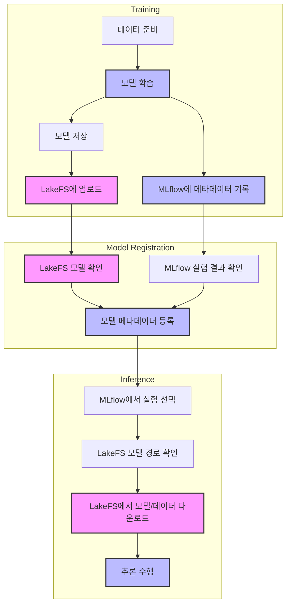

# Image Segmentation with MLOps

이미지 세그멘테이션 모델의 학습, 버전 관리, 추론을 위한 MLOps 파이프라인입니다.

## 시스템 구성

- **Git**: 소스 코드 버전 관리
- **LakeFS**: 데이터와 모델 파일 버전 관리
- **MLflow**: 실험 메타데이터 추적 및 모델 레지스트리

## 워크플로우 다이어그램



## 설치 방법

1. 필요한 패키지 설치:
```bash
pip install -r requirements.txt
```

2. LakeFS 설정:
- LakeFS 서버 실행:
```bash
docker compose --profile local-lakefs up
```
- `config.py`에서 LakeFS 접속 정보 설정

3. MLflow 설정:
- MLflow 서버 실행 (docker-compose에 포함)
- `config.py`에서 MLflow 접속 정보 설정

## 시스템 아키텍처

### 1. 데이터 및 모델 관리
- **LakeFS**: 실제 데이터와 모델 파일을 저장하고 버전 관리
  - 학습 데이터: `lakefs://repo-name/main/data/`
  - 모델 파일: `lakefs://repo-name/main/models/model.pth`

- **MLflow**: 실험 메타데이터 추적
  - 하이퍼파라미터
  - 학습 메트릭 (loss, accuracy 등)
  - LakeFS 모델 경로
  - Git commit hash

### 2. 워크플로우

1. **모델 학습 (train.py)**
   - 데이터 준비
   - 모델 학습 수행
   - MLflow에 메타데이터 기록:
     - 하이퍼파라미터
     - 학습 메트릭
     - LakeFS 모델 경로
   - 모델 파일을 LakeFS에 저장

2. **모델 등록 (register_model.py)**
   - LakeFS에서 모델 존재 확인
   - MLflow에서 실험 결과 확인
   - 성능이 기준을 만족하면 모델 메타데이터 등록
   - 실제 모델은 LakeFS에 유지

3. **모델 추론 (infer.py)**
   - MLflow에서 실험 선택 (메타데이터)
   - MLflow에서 LakeFS 모델 경로 확인
   - LakeFS에서 실제 모델과 데이터 다운로드
   - 추론 수행

## 사용 방법

### 1. 모델 학습
```bash
python train.py
```
- 모델이 학습되고 `models/model.pth` 파일이 생성됩니다.
- MLflow에 실험 메타데이터가 기록됩니다.
- 학습된 모델이 LakeFS에 업로드됩니다.

### 2. 모델 등록
```bash
python register_model.py
```
- LakeFS에 업로드된 모델을 확인합니다.
- MLflow에 모델 메타데이터를 등록합니다.
- `--manual` 옵션으로 수동 등록 가능

### 3. 모델 추론
```bash
python infer.py
```
- MLflow에서 등록된 모델 메타데이터를 선택합니다.
- LakeFS에서 실제 모델과 데이터를 다운로드합니다.
- `--interactive` 옵션으로 수동 모델 선택 가능

## 프로젝트 구조
```
image-segmentation-local/
├── train/              # 학습 관련 모듈
├── inference/          # 추론 관련 모듈
├── utils/             # 유틸리티 함수
├── models/            # 학습된 모델 저장
├── data/              # 데이터 디렉토리
├── train.py           # 학습 스크립트
├── register_model.py  # 모델 등록 스크립트
└── infer.py           # 추론 스크립트
```

## 주의사항

- LakeFS와 MLflow 서버가 실행 중이어야 합니다.
- 환경 변수가 올바르게 설정되어 있어야 합니다.
- Git은 소스 코드 관리, LakeFS는 데이터/모델 관리, MLflow는 메타데이터 추적용으로 사용됩니다.
